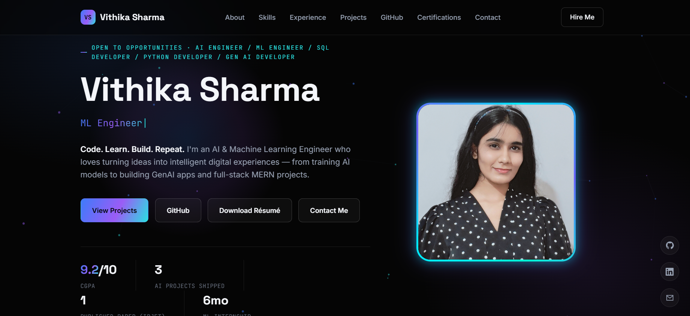

# 🌐 Vithika Sharma - Portfolio

Welcome to my personal portfolio website! 🚀

This portfolio showcases my projects, technical skills, achievements, certifications, and experience in Artificial Intelligence, Machine Learning, and Software Development.

🔗 **Live Portfolio:** https://vithikasharma-portfolio.vercel.app/

---

## 👩‍💻 About Me

Hi! I'm **Vithika Sharma**, a Computer Engineering (AI & ML) graduate passionate about building intelligent applications and solving real-world problems using Artificial Intelligence.

I enjoy developing AI-powered products, full-stack web applications, and machine learning solutions while continuously learning new technologies.

---

## ✨ Features

- 🎨 Modern Cyberpunk-inspired UI
- 🌙 Dark Theme
- 📱 Fully Responsive Design
- ⚡ Smooth Animations
- 👩 Professional Introduction
- 💻 Technical Skills Section
- 🚀 Featured Projects
- 📜 Certifications
- 🏆 Achievements
- 📄 Resume Download
- 📬 Contact Section
- 🔗 Social Media Links
- 📈 GitHub Integration

---

## 🛠️ Tech Stack

### Frontend
- HTML5
- CSS3
- JavaScript

### Design
- CSS Animations
- Responsive Design
- Glassmorphism
- Cyberpunk Theme

### Deployment
- Vercel

---

## 🚀 Featured Projects

### 🤖 Bidu AI
An AI-powered Bollywood-inspired educational chatbot built using Google Gemini to make learning engaging and interactive.

### 👵 SaharaBot
An AI-powered Elderly Healthcare Management System featuring medication reminders, OCR-based prescription analysis, voice assistance, and emergency SOS support.

AI Resume Analyzer
Evaluates resumes against job descriptions in real time.Generates ATS scores, skill-gap analysis, personalized feedback, and interview questions.

---

## 📸 Portfolio Preview



---

## 📂 Project Structure

```
Portfolio/
│── index.html
│── photo.jpg
│── resume.pdf
│── README.md
```

---

## 🖥️ Run Locally

Clone the repository

```bash
git clone https://github.com/Vithikasharma06/PORTFOLIO.git
```

Go to the project folder

```bash
cd PORTFOLIO
```

Open `index.html` in your browser.

---

## 📫 Connect With Me

📧 Email: vithika2064@gmail.com

💼 LinkedIn:
[https://linkedin.com/in/vithika-sharma-7603b7262]

🐙 GitHub:
[https://github.com/Vithikasharma06]

🌐 Portfolio:
[https://vithikasharma-portfolio.vercel.app/]

---

## ⭐ Support

If you like this project, please consider giving it a ⭐ on GitHub!

---

## 📄 License

This project is licensed under the MIT License.

Feel free to fork, explore, and use it for learning purposes.
